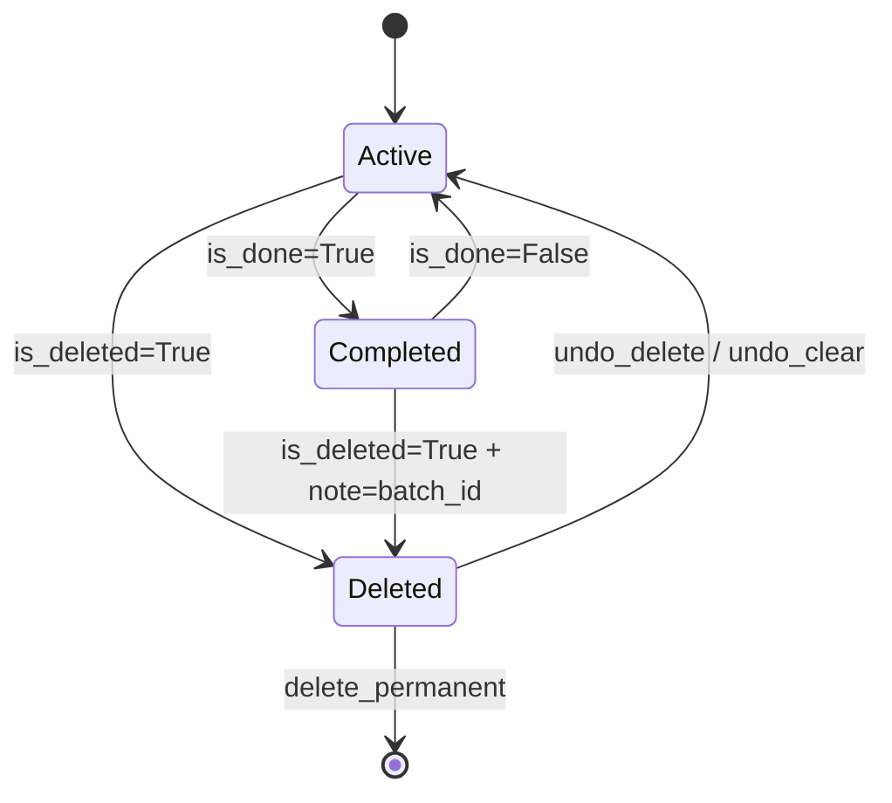
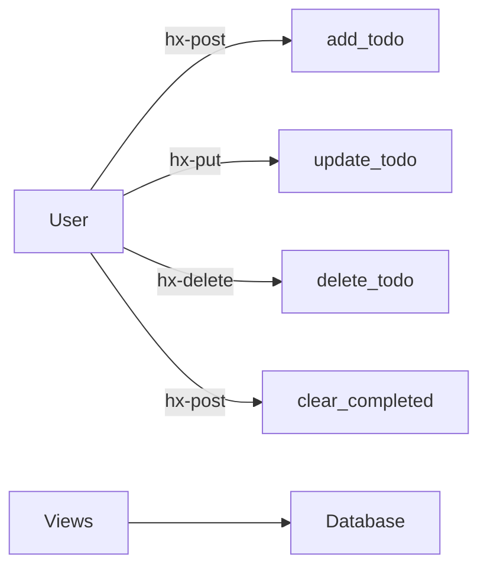
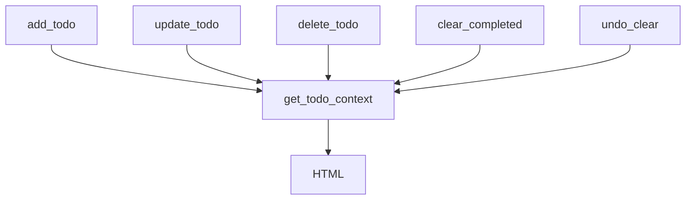
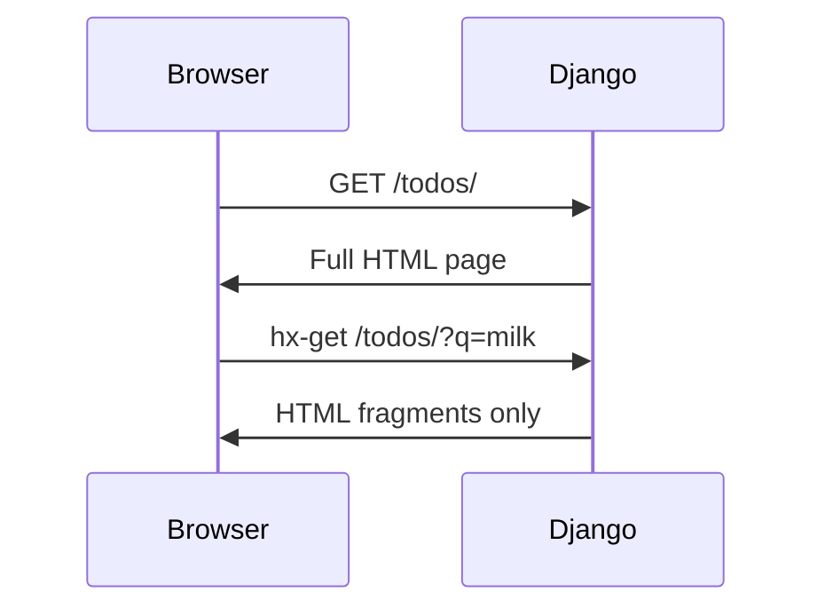
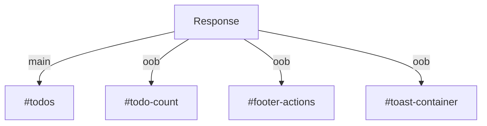
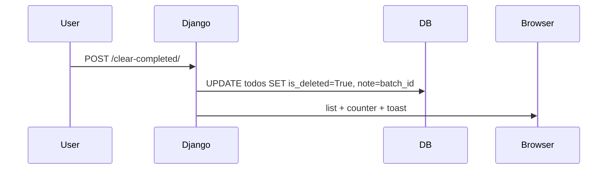
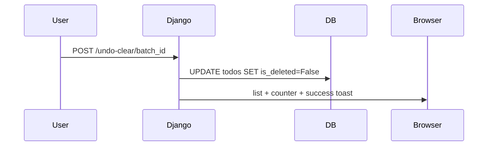
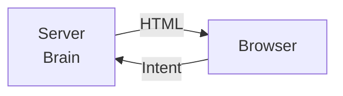

# 🧠 Django + HTMX Todo App

## A Full Architectural & Code Walkthrough


## Core Philosophy 

This is **not** a frontend + backend split application.

> **HTML is the API**
> **Django is the brain**
> **HTMX is the transport layer**

There is **no frontend state** worth naming.
The **server owns truth**. The browser renders **projections of that truth**.

No JSON.
No reducers.
No hydration.
No cache invalidation bugs.

---

## 🧭 High‑Level Mental Model

```text
User Intent
   ↓
HTTP Request (hx-*)
   ↓
Django View (transaction)
   ↓
Database (single source of truth)
   ↓
HTML Fragments
   ↓
HTMX Swaps (DOM reconciliation)
```

This loop repeats for **every interaction**.

---

## 🧱 1. The Data Layer — `Todo` as a Domain Object

### Mental Model: “What exists in the world?”

Your **entire application state** is represented by **one table**.

```python
class Todo(models.Model):
    title
    priority
    is_done
    is_deleted
    note
    created_at
    updated_at
```

Everything else in the system is a **view over this truth**.

---

### The Actual Model (`todo/models.py`)

```python
class Todo(models.Model):
    PRIORITY_CHOICES = [
        ('low', 'Low'),
        ('medium', 'Medium'),
        ('high', 'High'),
    ]

    title = models.CharField(max_length=255)
    priority = models.CharField(max_length=10, choices=PRIORITY_CHOICES, default='medium')
    is_done = models.BooleanField(default=False)
    is_deleted = models.BooleanField(default=False)  # soft delete
    note = models.CharField(max_length=100, blank=True, db_index=True)  # batch undo tag
    created_at = models.DateTimeField(auto_now_add=True)
    updated_at = models.DateTimeField(auto_now=True)

    class Meta:
        ordering = ['-created_at']

    def __str__(self):
        return self.title
```

---

### 🧠 Mental Model: Soft Delete ≠ Delete

```text
DELETE (traditional)
└── row removed → state lost forever

SOFT DELETE (this design)
└── is_deleted = True → state preserved
```

**Why this matters:**

* Trash view
* Undo delete
* Batch restore
* Safe UX (nothing irreversible by default)

---

### 🧠 Mental Model: `note` as a Transaction Tag

You are **not storing a note**.
You are storing a **transaction identifier**.

```text
Clear Completed
└── batch_1700000000 applied to N todos

Undo Clear
└── WHERE note=batch_1700000000 → restore all
```

This is **event‑sourcing lite**, implemented with one column.

---

### Mermaid — Data State Transitions



---

## 🧭 2. URL Routing — URLs as an Intent API

### Mental Model: “Each URL = One User Intent”

You are **not routing pages**.
You are routing **verbs**.

```python
# core/urls.py
urlpatterns = [
    path('', views.todos, name='todos'),
    path('filter/<str:filter_type>/', views.todos, name='filter_todos'),

    path('add-todo/', views.add_todo, name='add_todo'),
    path('update-todo/<int:pk>/', views.update_todo, name='update_todo'),
    path('delete-todo/<int:pk>/', views.delete_todo, name='delete_todo'),

    path('undo-delete/<int:pk>/', views.undo_delete, name='undo_delete'),
    path('undo-clear/<str:batch_id>/', views.undo_clear, name='undo_clear'),

    path('toggle-all/', views.toggle_all, name='toggle_all'),
    path('clear-completed/', views.clear_completed, name='clear_completed'),
    path('empty-trash/', views.empty_trash, name='empty_trash'),
]
```

This is **RESTful behavior**, returning **HTML**, not JSON.

---

### Mermaid — Intent Routing



---

## 🧠 3. `get_todo_context()` — The Single Source of Truth

### Mental Model: “One brain, many limbs”

Every list render — **no matter why it happens** — goes through this function.

```python
def get_todo_context(filter_type="all", query=""):
    if filter_type == "deleted":
        todos = Todo.objects.filter(is_deleted=True)
    else:
        todos = Todo.objects.filter(is_deleted=False)

    if query:
        todos = todos.filter(title__icontains=query)

    if filter_type == "active":
        todos = todos.filter(is_done=False)
    elif filter_type == "completed":
        todos = todos.filter(is_done=True)

    todos = todos.annotate(
        priority_order=Case(
            When(priority='high', then=Value(3)),
            When(priority='medium', then=Value(2)),
            When(priority='low', then=Value(1)),
            default=Value(1),
            output_field=IntegerField(),
        )
    ).order_by('-priority_order', '-created_at')

    return {
        "todos": todos,
        "count": Todo.objects.filter(is_deleted=False, is_done=False).count(),
        "filter_type": filter_type,
        "query": query,
    }
```

**Why this prevents chaos:**

* Same filtering everywhere
* Same sorting everywhere
* Same counts everywhere
* Search preserved during bulk actions

---

### Mermaid — Context Authority



---

## 🧠 4. Dual‑Purpose View — `todos()`

### Mental Model: “Same brain, two faces”

```python
if request.headers.get("HX-Request"):
    return fragments
else:
    return full_page
```

Same URL.
Same logic.
Different **response shape**.

---

### Mermaid — Request Shape Split



This eliminates separate APIs, routing, and hydration.

---

## ⚡ 5. HTMX Patterns (The Magic)

### 🧠 Mental Model: “HTML diffs over the wire”

HTMX **never updates state**.
It updates **DOM projections of server state**.

---

### A. Out‑of‑Band (OOB) Swaps

```html
<span id="todo-count" hx-swap-oob="true">
```

> This fragment knows where it belongs.

HTMX scans the response and patches the DOM **globally**.

---

### Mermaid — OOB Swap Topology



One response. Multiple updates. No JS glue.

---

### B. The Signal Pattern (`HX-Trigger`)

```python
response["HX-Trigger"] = "todoUpdated"
```

```html
<div id="todos"
     hx-get=""
     hx-trigger="todoUpdated from:body"
     hx-include="[name='q']">
```

The **server emits events**. The UI reacts.

---

### Mermaid — Signal Flow

```mermaid
sequenceDiagram
    User->>Django: POST /add-todo/
    Django->>Browser: HX-Trigger: todoUpdated
    Browser->>Browser: dispatch todoUpdated
    #todos->>Django: hx-get /todos/?q=
    Django->>#todos: fresh list HTML
```

---

## 🖼️ 6. Templates as Server‑Side Components

### Mental Model: “Fragments, not pages”

| Template         | Responsibility    |
| ---------------- | ----------------- |
| `todos.html`     | Application shell |
| `list.html`      | Todo list loop    |
| `todo.html`      | Single row view   |
| `todo_edit.html` | Inline edit form  |
| `counter.html`   | Remaining count   |
| `toast.html`     | Feedback + undo   |

---

### In‑Place Editing Pattern

```text
Row → Edit Form → Row
```

No modals. No JS state. No sync bugs.

---

### Mermaid — Row Lifecycle

```mermaid
sequenceDiagram
    User->>Django: hx-get /edit-todo/5/
    Django->>#todo-5: edit form
    User->>Django: hx-post /update-todo/5/
    Django->>#todo-5: updated row
```

---

## 🔁 7. Action Views as Transactions

### Mental Model: “Each view = one transaction”

```text
1. Validate intent
2. Mutate DB (atomic)
3. Re-render truth
4. Return HTML + signals
```

---

### Mermaid — Clear Completed



---

### Mermaid — Undo Clear



---

## 🧠 8. Why This Architecture Works

```text
Server owns:
- State
- Sorting
- Filtering
- Validation
- Events

Client owns:
- Rendering
- Transitions
- User input
```

No duplicated logic. No stale caches. No race conditions.

---

### Mermaid — Responsibility Split



---

## ✅ Final Mental Model (Commit This)

```text
Database = Truth
Views     = Transactions
Templates = Projections
HTMX      = Transport
Events    = Glue
```

