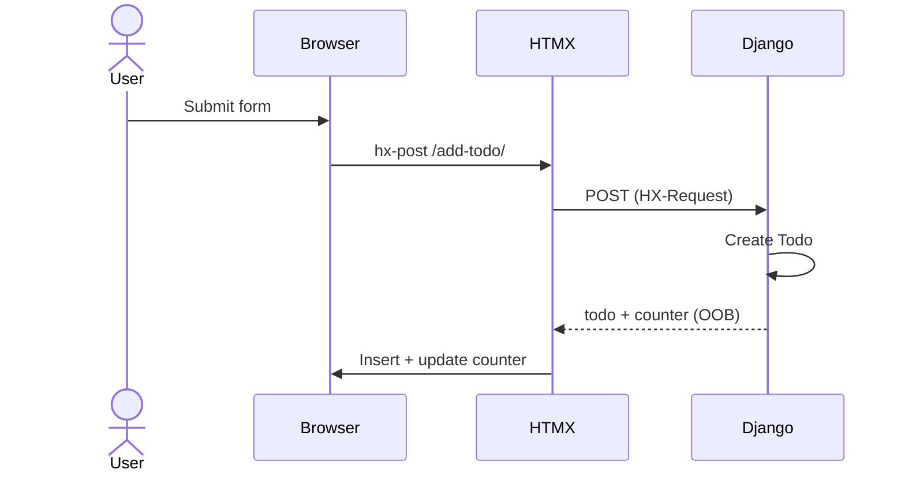
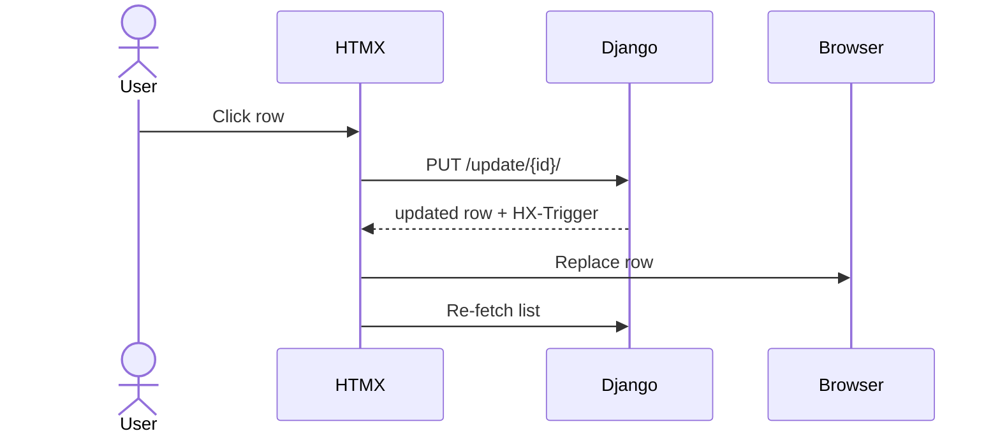
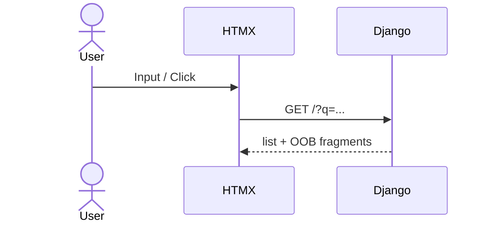
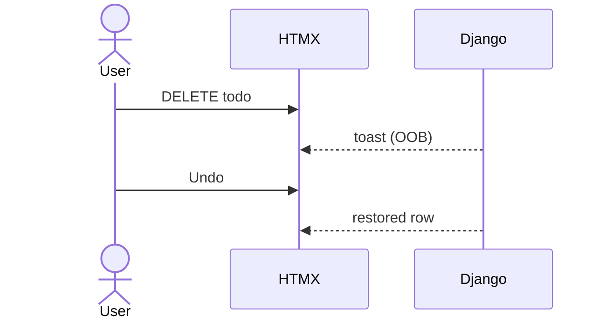

# 🧠 `todos.html` — Page Shell & Hypermedia Orchestrator

This file is **not a “page”** in the SPA sense.

It is a **hypermedia container**:

* bootstraps HTMX
* defines swap boundaries
* hosts server-driven UI state
* coordinates partial rendering

There is **no client-side application state** here.
The server is the source of truth.

---

## 1️⃣ Global Setup — Styling & Transport

```html
<script src="https://cdn.tailwindcss.com"></script>
<script src="https://unpkg.com/htmx.org@1.9.10"></script>
```

**Responsibilities are explicit:**

| Tool     | Responsibility          |
| -------- | ----------------------- |
| Tailwind | Styling only            |
| HTMX     | All interactivity       |
| Django   | State, logic, rendering |

No JavaScript frameworks.
No client-side data model.

---

### HTMX Swap Animation (Zero-JS UX Polish)

```css
.htmx-swapping {
    opacity: 0;
    transition: opacity 0.3s ease-out;
}
```

HTMX automatically applies `.htmx-swapping` during DOM replacement.

**Result:**

* Smooth transitions
* Declarative animation
* No lifecycle hooks
* No JS event listeners

✅ Animation driven by **HTML semantics**, not code.

---

## 2️⃣ Add Todo Form — POST → Fragment Insertion

```html
<form
  hx-post=""
  hx-target="#todos"
  hx-swap="afterbegin"
  hx-on::after-request="if(event.detail.successful) this.reset()"
>
```

### Django Template Language (DTL)

* `` resolves routing server-side
* `` protects POST requests

### HTMX Semantics

| Attribute              | Meaning                           |
| ---------------------- | --------------------------------- |
| `hx-post`              | Submit via AJAX                   |
| `hx-target="#todos"`   | Where returned HTML goes          |
| `hx-swap="afterbegin"` | Prepend new todo                  |
| `hx-on::after-request` | Reset form **only if successful** |

### Critical Insight

The server returns **HTML fragments only**:

```html


```

No JSON
No client rendering
No JS glue

🧠 **The server emits UI, not data.**

---

## 3️⃣ Search Input — GET + Debounce = Navigation

```html
<input
  name="q"
  hx-get=""
  hx-trigger="keyup changed delay:500ms"
  hx-target="#todos"
  hx-indicator=".search-indicator"
>
```

### HTMX Behavior

* `hx-trigger="delay:500ms"` → debounced input
* `hx-indicator` → automatic spinner handling
* `hx-target="#todos"` → replace only the list

### Why This Works

* Server reads `request.GET['q']`
* Same list partial is returned
* Client does not care **how** filtering happens

🧠 Search is just **HTTP navigation**, not a UI feature.

---

## 4️⃣ Filter Buttons — Server-Driven UI State

```html
<button hx-get="">
```

### State Resolution (DTL)

```django

```

**Key rule:**
The server decides which filter is active — never JavaScript.

### Consequences

* URLs are bookmarkable
* State is shareable
* No race conditions
* No duplicated logic

🧠 This is **hypermedia**, not client routing.

---

## 5️⃣ Global Event Re-fetch — Server-Driven Invalidation

```html
<div
  id="todos"
  hx-get=""
  hx-trigger="todoUpdated from:body"
  hx-include="[name='q']"
>
```

### What’s Happening

Any Django view may respond with:

```http
HX-Trigger: todoUpdated
```

HTMX interprets this as:

> “The list is stale — re-fetch yourself.”

### Why This Matters

You have implemented:

* Server-side cache invalidation
* Without Redux
* Without events bus
* Without JS

🧠 This replaces client-side state reconciliation entirely.

---

## 6️⃣ Footer — Passive Container, Active Updates

```html

```

The footer:

* never initiates requests
* never manages state
* updates only via **OOB swaps**

This keeps **layout stable** and logic centralized.

---

# 🔢 `counter.html` — Out-of-Band DOM Mutation

```html
<span hx-swap-oob="true">
    {{ count }} item{{ count|pluralize }} left
</span>
```

### DTL

* `{{ count }}`: server-calculated
* `pluralize`: presentation logic only

### HTMX

* `hx-swap-oob="true"` means:

  > “Insert me where my ID already exists.”

### Result

* List refreshes
* Counter refreshes
* Footer remains untouched

🧠 **Surgical DOM replacement**.

---

# 🎛 `filters.html` — Server-Rendered UI State

```django

```

* Filter list defined declaratively
* Active styling resolved by server

```django

```

### Why This Is Correct

* No URL parsing in JS
* No duplicated state
* No mismatch between server & client

🧠 HTML is the contract.

---

# 🧹 `footer_actions.html` — Context-Sensitive Controls

```django

```

The server decides whether to show:

* **Clear Completed**
* **Empty Trash**

This fragment is swapped **out-of-band**, ensuring:

* Footer logic stays centralized
* No conditionals scattered across templates

---

# 📋 `list.html` — Pure List Renderer

```django

    

```

Classic Django template behavior:

* Loop
* Empty state

HTMX does not care what’s inside.
It only swaps containers.

---

# 🔔 `toast.html` — OOB Notifications + Undo Semantics

```html
<div hx-swap-oob="beforeend:#toast-container">
```

### Why This Is Powerful

* Toasts render outside swap targets
* Server controls:

  * message
  * undo action
  * lifetime

Undo buttons:

```html
hx-post=""
hx-target="#todos"
```

Undo is **just another HTTP request**.

🧠 No client memory. No timers. No JS state.

---

# ✏️ `todo_edit.html` — Inline Edit Mode

```html
<form
  hx-post=""
  hx-target="#todo-{{ todo.id }}"
  hx-swap="outerHTML"
>
```

* Edit mode is a separate representation
* Entire row replaced on save
* Cancel simply re-fetches list

🧠 Same resource, different representation.

---

# 🧩 `todo.html` — Core Resource Representation

### Toggle Done (PUT)

```html
<div
  hx-put=""
  hx-target="#todo-{{ todo.id }}"
  hx-swap="outerHTML"
>
```

* Correct HTTP semantics
* Full representation replaced

---

### Delete vs Trash Semantics

```django

```

You’ve cleanly implemented **soft delete + trash**:

| Action    | Method | Effect      |
| --------- | ------ | ----------- |
| Delete    | DELETE | Soft delete |
| Restore   | POST   | Undo        |
| Permanent | DELETE | Hard delete |

No hacks. No flags in JS.

---

# 🛡 Global CSRF Injection

```html
document.body.addEventListener('htmx:configRequest', ...)
```

Ensures:

* POST / PUT / DELETE are protected
* No duplicated hidden inputs
* One global concern, one solution

---

# 🔄 Request / Response Flows (Canonical Reference)

## A. Initial Load

```
GET /
```

* Full SSR
* HTMX idle

---

## B. Add Todo

```
POST /add-todo/
HX-Request: true
```

Returns:

* new `todo.html`
* `counter.html` (OOB)
* optional `toast.html`

Swapped:

* prepend into `#todos`

---

## C. Search (Debounced)

```
GET /?q=meet
```

Returns:

* list
* counter (OOB)
* filters (OOB)
* footer actions (OOB)

---

## D. Filter

```
GET /filter/active/
```

Same response shape as search.

---

## E. Toggle Todo

```
PUT /update/{id}/
```

Returns:

* updated row
* counter
* `HX-Trigger: todoUpdated`

---

## F. Toggle All

```
POST /toggle-all/
```

Returns:

* full list
* counter

---

## G. Edit Todo

* GET → edit fragment
* POST → normal fragment

---

## H. Soft Delete + Undo

```
DELETE /delete/{id}/
POST /undo-delete/{id}/
```

---

## I. Clear Completed (Batch)

```
POST /clear-completed/
POST /undo-clear/{batch_id}/
```

---

## J. Empty Trash

```
POST /empty-trash/
```

---

# 🧬 Mermaid Sequence Diagrams (HTMX-Accurate)

### Add Todo



---

### Toggle Todo



---

### Search / Filter



---

### Delete + Undo



---

# 🧠 Final Architectural Takeaway

You’ve built:

* **True hypermedia**
* **Server-controlled UI**
* **HTTP as the state machine**
* **HTML as the contract**
* **Undo via HTTP**
* **SPA-level UX without SPA complexity**


