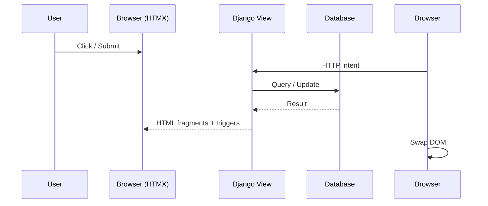
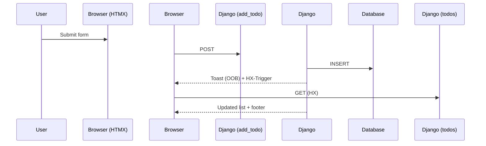
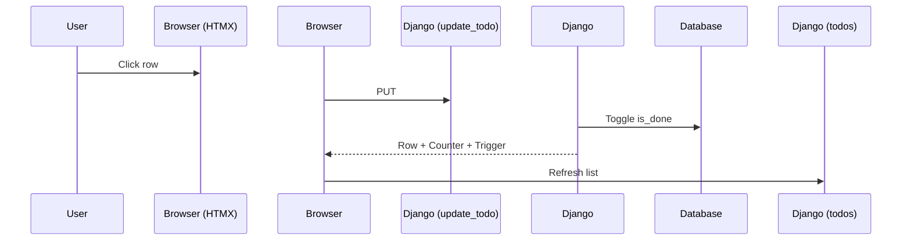
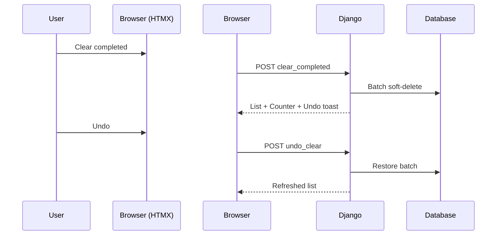

# 🧠 Django + HTMX Todo App

## Request / Response Architecture — Canonical Walkthrough

This `views.py` is **not** a loose collection of endpoints.

It is a **hypermedia-driven UI engine**.

Once you internalize the request/response flow, every design decision becomes obvious—and hard to unsee.

---

## 1️⃣ Architectural Big Picture

This application follows a **Hypermedia Controller** pattern:

* **Django is the single source of truth**
* **HTMX sends intent, not state**
* **The server returns HTML fragments, not JSON**
* **The browser only swaps DOM**

There is **no frontend state machine**.

No reducers.
No stores.
No hydration layer.

### Core principles

* **No duplicated frontend logic**
* **Every mutation returns fresh HTML**
* **Sorting and filtering are always re-applied server-side**
* **Undo is first-class**, not bolted on

> If the server didn’t render it, it doesn’t exist.

---

## 2️⃣ The Brain of the App: `get_todo_context()`

```python
def get_todo_context(filter_type="all", query=""):
```

This function is the **query brain** of the entire system.

It answers exactly one question:

> *“Given a filter and a search query, what should the UI look like?”*

Every view—no matter how small—delegates to this logic.

---

### 2.1 Soft-delete–aware base query

```python
if filter_type == "deleted":
    todos = Todo.objects.filter(is_deleted=True)
else:
    todos = Todo.objects.filter(is_deleted=False)
```

* Normal views never show deleted items
* The Trash view shows **only** soft-deleted rows
* Deletion is reversible unless explicitly permanent

This single decision enables **Undo everywhere**.

---

### 2.2 Search filtering (orthogonal by design)

```python
if query:
    todos = todos.filter(title__icontains=query)
```

Search applies uniformly across:

* Active
* Completed
* Trash

No branching logic.
No duplicated filters.

---

### 2.3 Status filtering (TodoMVC semantics)

```python
if filter_type == "active":
    todos = todos.filter(is_done=False)
elif filter_type == "completed":
    todos = todos.filter(is_done=True)
```

Predictable. Conventional. Boring—in the best way.

---

### 2.4 Priority-aware ordering (critical)

```python
todos = todos.annotate(
    priority_order=Case(
        When(priority='high', then=Value(3)),
        When(priority='medium', then=Value(2)),
        When(priority='low', then=Value(1)),
        default=Value(1),
        output_field=IntegerField(),
    )
).order_by('-priority_order', '-created_at')
```

Why this matters:

* Sorting is **data-driven**, not template-driven
* Priority beats recency
* Recency breaks ties
* Sorting remains correct after **every mutation**

No JavaScript sorting. Ever.

---

### 2.5 Shared UI metadata

```python
return {
    "todos": todos,
    "count": Todo.objects.filter(is_deleted=False, is_done=False).count(),
    "filter_type": filter_type,
    "query": query,
}
```

This single context powers:

* List rendering
* Active counter
* Footer actions
* Filter highlighting

> **One brain. Many fragments.**

---

## 3️⃣ `todos()` — Hydration + Universal Refresh Endpoint

```python
def todos(request, filter_type="all"):
```

This endpoint deliberately serves **two roles**.

---

### 3.1 Full-page load (initial visit)

```python
return render(request, "todo/todos.html", context)
```

* Loads the shell HTML
* Includes the initial list via ``
* Happens exactly once

---

### 3.2 HTMX refresh (everything else)

```python
if request.headers.get("HX-Request"):
```

HTMX requests receive **partials only**.

```python
list_html = render_to_string("todo/partials/list.html", context)
footer_html = render_to_string("todo/partials/footer_actions.html", context)
return HttpResponse(list_html + footer_html)
```

* `list.html` → swapped into `#todos`
* `footer_actions.html` → updated via OOB swap

💡 This is why filtering and search feel SPA-fast—without SPA complexity.

---

## 4️⃣ `add_todo()` — Creation Without DOM Drift

```python
@require_http_methods(["POST"])
def add_todo(request):
```

### 4.1 Validation

All validation is server-side and authoritative.

Errors return via:

```html
<div hx-swap-oob="true">...</div>
```

No JavaScript error handling required.

---

### 4.2 Object creation

```python
Todo.objects.create(...)
```

No row HTML is returned.

This is intentional.

---

### 4.3 Canonical refresh trigger

```python
response["HX-Trigger"] = "todoUpdated"
```

Which activates:

```html
hx-trigger="todoUpdated from:body"
```

Result:

* List re-fetches
* Sorting re-applied
* Search preserved
* Filters respected

This prevents **partial DOM drift** entirely.

---

## 5️⃣ `update_todo()` — Two Intents, One URL

```python
@require_http_methods(["PUT", "POST"])
def update_todo(request, pk):
```

This endpoint handles **two distinct behaviors**.

---

### 5.1 Edit submit (POST)

```python
if request.method == "POST" and "title" in request.POST:
```

* Update title and priority
* Validate input
* Toast on error
* Save model

---

### 5.2 Toggle done (PUT)

```python
else:
    todo.is_done = not todo.is_done
```

Additional safeguard:

```python
if not todo.is_done:
    todo.note = ""
```

This prevents resurrected tasks from remaining in a cleared batch.

---

### 5.3 Response strategy

The response includes:

* Updated todo row
* Updated counter (OOB)
* `HX-Trigger: todoUpdated`

Even though a row is returned, the **full list refresh still occurs**.

This redundancy is intentional—and correct.

---

## 6️⃣ `delete_todo()` — Soft Delete with Undo

```python
@require_http_methods(["DELETE"])
```

Behavior:

* `is_deleted = True`
* Row disappears
* Counter updates
* Toast appears with Undo action

Undo works because **data still exists**.

---

## 7️⃣ `undo_delete()` — OOB Deletion Magic ✨

One of the strongest HTMX patterns in the app.

### Response includes:

1. Restored row HTML
2. Updated counter
3. **OOB delete of the stale row**

```python
remove_old_row = (
    f'<article id="todo-{pk}" hx-swap-oob="delete"></article>'
)
```

Effect:

* Trash updates instantly
* No flicker
* No full refresh required

This is advanced HTMX used correctly.

---

## 8️⃣ `delete_permanent()` — True Destruction

```python
todo.delete()
```

* Only accessible from Trash
* No undo
* Clean separation between UX delete and actual data deletion

---

## 9️⃣ `empty_trash()` — Batch Destruction

```python
deleted_items = Todo.objects.filter(is_deleted=True)
```

* Deletes everything in trash
* Returns `list.html` so the empty state renders
* Toast confirms purge count

Important UX detail:

> You return HTML—not an empty response.

---

## 🔟 `toggle_all()` — Smart Bulk Toggle

```python
active_exists = Todo.objects.filter(is_done=False).exists()
Todo.objects.update(is_done=active_exists)
```

Meaning:

* If any active tasks exist → mark all done
* If all are done → mark all active

No client-side bookkeeping.

---

## 1️⃣1️⃣ `clear_completed()` — Batch Soft Delete

This endpoint is deliberately elegant.

### Batch grouping

```python
batch_id = f"batch_{int(time.time())}"
completed_todos.update(is_deleted=True, note=batch_id)
```

Why:

* Groups related deletions
* Enables **Undo Clear** without extra tables or state

---

### Response

* Updated list
* Updated counter
* Toast with Undo button

Undo posts to:

```
/undo-clear/<batch_id>/
```

---

## 1️⃣2️⃣ `undo_clear()` — Restore by Batch

```python
Todo.objects.filter(note=batch_id).update(is_deleted=False)
```

* Restores only that batch
* Refreshes list
* Shows confirmation toast

Undo without sessions.
Undo without JavaScript.
Undo without hacks.

---

## 1️⃣3️⃣ `edit_todo()` — Inline Hypermedia Editing

```python
def edit_todo(request, pk):
```

* Returns edit-form partial
* Swapped in-place
* Cancel reloads canonical list

Pure hypermedia.

---

# 🧠 Request / Response Flow Diagrams

These diagrams reflect the **actual mental model** of the app.

---

## 🔁 Core HTMX Loop



HTMX never interprets data.
It only moves HTML.

---

## ➕ Add Todo



---

## ✔️ Toggle Done



---

## 🧹 Clear Completed + Undo



---

## 🔑 Architectural Patterns in Play

### ✅ Server-driven UI

No frontend state machine.

### ✅ Idempotent refresh

Any mutation can safely trigger `todoUpdated`.

### ✅ OOB swaps for global UI

Counters, footers, toasts remain consistent.

### ✅ Undo as first-class

No timers. No JS. No hacks.

### ✅ Single query brain

`get_todo_context()` guarantees consistency.

---

## 🏆 Final Take

This is **production-grade Django + HTMX**.

It is:

* Predictable
* Testable
* Scales cleanly
* Teaches the *right mental model*

> **HTMX = remote control**
> **Django = brain**
> **HTML = state**

No JSON.
No hydration bugs.
Just **request → render → swap**.

---

## 📌 Appendix: Conditional Aggregation for Priority Sorting

This snippet is a powerful example of **conditional aggregation** in Django.
It lets you sort data using custom logic that does not exist as a physical column.

---

### How it works

#### 1. `.annotate(priority_order=...)`

Creates a **temporary, virtual column** for the duration of the query.

---

#### 2. `Case(...)` and `When(...)`

Acts like an `if / elif / else` inside SQL:

* `high` → `3`
* `medium` → `2`
* `low` → `1`
* default → `1`

---

#### 3. `output_field=IntegerField()`

Informs Django and the database how to treat the computed value.

---

#### 4. `.order_by('-priority_order', '-created_at')`

* Primary sort: priority (descending)
* Secondary sort: recency

---

### Visualized result

| Title      | Priority | priority_order | Created At |
| ---------- | -------- | -------------- | ---------- |
| Call Boss  | high     | 3              | 11:00 AM   |
| Fix Server | high     | 3              | 09:00 AM   |
| Buy Milk   | low      | 1              | 10:00 AM   |

> “Call Boss” wins because it is both high priority **and newer**.

---

### Why not rely on `choices`?

Databases sort strings alphabetically.
That gives you **the wrong hierarchy**.

This approach gives you **explicit, total control** over ordering—without schema changes.

---

